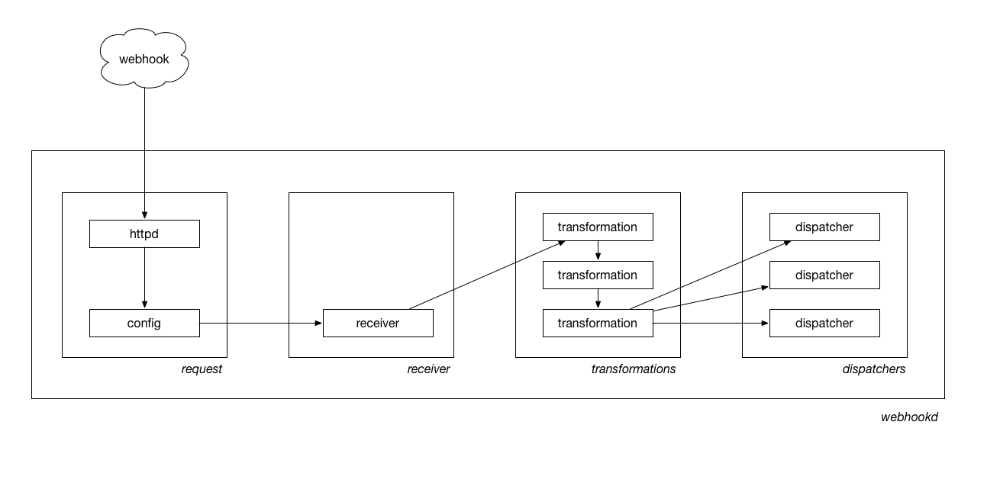

# go-webhookd



What is the simplest webhook-wrangling server-daemon-thing.

In many ways this is nothing more than a fancy bucket-brigade. By design.

Receivers handle the actual webhook side of things, doing auth and basic sanity checking and validation. Assuming everything is as it should be receivers return a bag of bytes (the actual webhook message that may or may not be massaged depending the receiver). That bag is then handed to one or more dispatchers which do _something_ with those bytes. Those details, including security considerations are left as an exercise to the reader.

In between (receivers and dispatchers) are an optional chain of transformations which accept bytes as their input, do _something_ with those bytes, and then return bytes.

## Install

You will need to have both `Go` and the `make` programs installed on your computer. Assuming you do just type:

```
make bin
```

All of this package's dependencies are bundled with the code in the `vendor` directory.

## Usage

### webhookd

```
./bin/webhookd -h
Usage of ./bin/webhookd:
  -config string
    	Path to a valid webhookd config file
```

`webhookd` is an HTTP daemon for handling webhook requests. Individual webhook endpoints (and how they are processed) are defined in a [config file](#config-files) that is read at start-up time.

#### Caveats

##### TLS

TLS is not supported yet so **you should not run `webhookd` on the public internets** without first putting a TLS-enabled proxy in front of it.

##### Dynamic endpoints

At some point there might be dynamic (or runtime) webhook endpoints but today there are not.

In the meantime you can gracefully restart `webhookd` by sending its PID a `USR2` signal which will cause the config file (and all the endpoints it defines) to be re-read. It's not elegant but it works. For example:

```
$> ./bin/webhookd -config config.json
2016/10/16 00:19:47 Serving 127.0.0.1:8080 with pid 2723

$> kill -USR2 2723
2016/10/16 00:19:59 Graceful handoff of 127.0.0.1:8080 with new pid 2724 and old pid 2723
2016/10/16 00:19:59 Exiting pid 2723.
```

### Setting up a `webhookd` server

While you can set up a `webhookd` server by hand it's probably easier to all that work with a config file and let code take care of all the details, including registering all the webhooks. [Config files](#config-files) are discussed in detail below.

_All error handling in the examples below have been removed for the sake of brevity._

#### Setting up a `webhookd` server with a handy config file

```
import (
	"github.com/whosonfirst/go-webhookd/config"
	"github.com/whosonfirst/go-webhookd/daemon"
)

wh_config, _ := config.NewConfigFromFile("config.json")

wh_daemon, _ := daemon.NewWebhookDaemonFromConfig(wh_config)
wh_daemon.Start()
```

_You can also just grab the HTTP handler func with `wh_daemon.HandlerFunc()` if you need or want to start a webhookd daemon in your own way._

#### Setting up a `webhookd` server "by hand"

```
import (
	"github.com/whosonfirst/go-webhookd"		
	"github.com/whosonfirst/go-webhookd/daemon"	
	"github.com/whosonfirst/go-webhookd/dispatchers"
	"github.com/whosonfirst/go-webhookd/receivers"
	"github.com/whosonfirst/go-webhookd/transformations"
	"github.com/whosonfirst/go-webhookd/webhook"	
)

wh_receiver, _ := receivers.NewInsecureReceiver()

null, _ := transfromations.NewNullTransformation()
wh_transformations := []webhookd.WebhookTransformation{ null }

pubsub, _ := dispatchers.NewPubSubDispatcher("localhost", 6379, "websocketd")
wh_dispatchers, _ := []webhookd.WebhookDispatcher{ pubsub }

wh, _ := webhook.NewWebhook("/foo", wh_receiver, wh_transformations, wh_dispatchers)

wh_daemon, _ := daemon.NewWebhookDaemon("localhost", 8080)
wh_daemon.AddWebhook(wh)
wh_daemon.Start()
```

See the way we're using an `Insecure` receiver and a `PubSub` dispatcher with a `Null` transformation? All are these are discussed in detail below.

## Sending stuff to webhookd

```
curl -v -X POST http://localhost:8080/foo -data-binary @README.md

* upload completely sent off: 703 out of 703 bytes
< HTTP/1.1 200 OK
< Date: Fri, 20 May 2016 01:31:05 GMT
< Content-Length: 0
< Content-Type: text/plain; charset=utf-8
< 
* Connection #0 to host localhost left intact
```

## Where did it go...

```
./bin/subscribe webhookd
{'pattern': None, 'type': 'subscribe', 'channel': 'webhookd', 'data': 1L}
{'pattern': None, 'type': 'message', 'channel': 'webhookd', 'data': '# go-webhookd## ImportantYou should not try to use this, yet. No. No, really.## UsageIt _should_ work something like this. If you\'re reading this sentence that means it _doesn\'t_.```import (\t"github.com/whosonfirst/go-webhookd"\t"github.com/whosonfirst/go-webhookd/dispatchers"\t"github.com/whosonfirst/go-webhookd/receivers")dispatcher := dispatchers.NewPubSubDispatcher("localhost", 6379, "pubsub-channel")receiver := receivers.NewGitHubReceiver("github-webhook-s33kret")endpoint := "/wubwubwub"webhook := webhookd.NewWebhook(endpoint, receiver, dispatcher)daemon := webhookd.NewWebHookDaemon(webhook)daemon.AddWebhook(webhook)daemon.Start()```## See also'}
```

In this case, it went to Redis [PubSub](http://redis.io/topics/pubsub) land! Where things go depend on how you've configured your [dispatchers](#dispatchers-1).

## Config files

Config files for `webhookd` are JSON files consisting of five top-level sections. An [example config file](config.json.example) is included with this repository. The five top-level sections are:

### daemon

```
	"daemon": {
		"host": "localhost",
		"port": 8080
	}
```

The `daemon` section is a dictionary defining configuration details for the `webhookd` daemon itself.

### receivers

```
	"receivers": {
		"insecure": {
			"name": "Insecure"
		},
		"github": {
			"name": "GitHub",
			"secret": "s33kret"
		}
	}
```

The `receivers` section is a dictionary of "named" receiver configuations. This allows the actual [webhook configurations (described below)](#webhooks) to signal their respective receivers using the dictionary "name" as a simple short-hand.

### transformations

```
	"transformations": {
		"chicken": {
			"name": "Chicken",
			"language": "zxx",
			"clucking": false
		}
	}
```

The `transformations` section is a dictionary of "named" tranformation configuations. This allows the actual [webhook configurations (described below)](#webhooks) to signal their respective transformations using the dictionary "name" as a simple short-hand.

### dispatchers

```
	"dispatchers": {
		"pubsub": {
			"name": "PubSub",
			"host": "localhost",
			"port": 6379,
			"channel": "webhookd"
		}
	}
```

The `dispatchers` section is a dictionary of "named" dispatcher configuations. This allows the actual [webhook configurations (described below)](#webhooks) to signal their respective dispatchers using the dictionary "name" as a simple short-hand.

### webhooks

```
	"webhooks": [
		{
			"endpoint": "/github-test",
			"receiver": "github",
			"dispatchers": [ "pubsub" ]
		},
		{
			"endpoint": "/insecure-test",
		 	"receiver": "insecure",
			"dispatchers": [ "pubsub" ]
		},
		{
			"endpoint": "/slack-test",
			"receiver": "slack",
			"transformations": [ "slack", "chicken" ],
			"dispatchers": [ "slack", "log"]
		}
	]
```

The `webhooks` section is a list of dictionaries. These are the actual webhook endpoints that clients (out there on the internet) will access.

* **endpoint** This is the path that a client will access. It _is_ the webhook URI that clients will send requests to.
* **receiver** The named receiver (defined in the `receivers` section) that the webhook will use to process requests.
* **transformations** An optional list of named transformations (defined in the `transformations` section) that the webhook process the message body with.
* **dispatchers** The list of named dispatchers (defined in the `dispatchers` section) that the webhook will relay a successful request to.

## Receivers

### GitHub

```
	{
		"name": "GitHub",
		"secret": "s33kret"
	}
```

This receiver handles Webhooks sent from [GitHub](https://developer.github.com/webhooks/). It validates that the message sent is actually from GitHub (by way of the `X-Hub-Signature` header) but performs no other processing.

#### Properties

* **name**  _string_ This is always `GitHub`.
* **secret** _string_ The secret used to generate [the HMAC hex digest](https://developer.github.com/webhooks/#delivery-headers) of the message payload.
* **ref** _string_ An optional Git `ref` to filter by. If present and a WebHook is sent with a different ref then the daemon will return a `666` error response.

### Insecure

```
	{
		"name": "Insecure"
	}
```

As the name suggests this receiver is completely insecure. It will happily accept anything you send to it and relay it on to the dispatcher defined for that webhook.

This receiver exists primarily for debugging purposes and **you should not deploy it in production**.

#### Properties

* **name** _string_ This is always `Insecure`.

### Slack

```
	{
		"name": "Slack"
	}
```

This receiver handles Webhooks sent from [Slack](https://api.slack.com/outgoing-webhooks). It does not process the message at all. _This receiver has not been fully tested yet so proceed with caution._

#### Properties

* **name** _string_ This is always `Slack`.

## Transformations

### Chicken

```
	{
		"name": "Chicken",
		"language": "zxx",
		"clucking": false
	}
```

The `Chicken` transformation will convert every word in your message to 🐔 using the [go-chicken](https://github.com/thisisaaronland/go-chicken) package. If this seems silly that's because it is. It's also more fun that yet-another boring _"make all the words upper-cased"_ example.

#### Properties

* **name** _string_ This is always `Chicken`.
* **language** _string_ A three-letter language code specifying which language `go-chicken` should use.
* **clucking** _bool_ A boolean flag indicating whether or not to [cluck](https://github.com/thisisaaronland/go-chicken#clucking) when generating results.

### GitHubCommits

```
	{
		"name": "GitHubCommits",
		"exclude_additions":false,
		"exclude_modification":false,
		"exclude_deletions":true,
	}
```

The `GitHubCommits` transformation will extract all the commits (added, modified, removed) from a `push` event and return a JSON encoded list of paths.

#### Properties

* **name** _string_ This is always `GitHubCommits`.
* **exclude_additions** _bool_ A flag to indicate that new additions in a commit should be ignored. Optional; default false.
* **exclude_modification** _bool_ A flag to indicate that modifications in a commit should be ignored. Optional; default false.
* **exclude_deletions** _bool_ A flag to indicate that deletions in a commit should be ignored. Optional; default false.

### Null

```
	{
		"name": "Null"
	}
```

The `Null` transformation will not do _anything_. It's not clear why you would ever use this outside of debugging but that's your business.

#### Properties

* **name** _string_ This is always `Null`.

### SlackText

```
	{
		"name": "SlackText"
	}
```

The `SlackText` transformation will extract and return [the `text` property](https://api.slack.com/outgoing-webhooks) from a Webhook sent by Slack.

#### Properties

* **name** _string_ This is always `SlackText`.

## Dispatchers

### Log

```
	{
		"name": "Log"
	}
```

The `Log` dispatcher will send messages to Go's logging facility. As of this writing that means everything is logged to STDOUT but eventually it will be more sophisticated.

#### Properties

* **name** _string_ This is always `Null`.

### Null

```
	{
		"name": "Null"
	}
```

The `Null` dispatcher will send messages in to the vortex, never to be seen again. This can be useful for debugging.

#### Properties

* **name** _string_ This is always `Null`.

### PubSub

```
	{
		"name": "PubSub",
		"host": "localhost",
		"port": 6379,
		"channel": "webhookd"
	}
```

The `PubSub` dispatcher will send messages to a Redis PubSub channel.

#### Properties

* **name** _string_ This is always `PubSub`.
* **host** _string_ The address of the Redis host you want to connect to.
* **port** _int_ The port number of the Redis host you want to connect to.
* **channel** _string_ The name of the Redis PubSub channel you want to send messages to.

### Slack

```
	{
		"name": "Slack",
		"config": "/path/to/.slackcat.conf"			
	}
```

The `Slack` dispatcher will send messages to a Slack channel using the [slackcat](https://github.com/whosonfirst/slackcat#configuring) package.

#### Properties

* **name** _string_ This is always `Slack`.
* **config** _string_ The path to a valid [slackcat](https://github.com/whosonfirst/slackcat#configuring) config file. _Eventually you will be able to specify a plain-vanilla Slack Webhook URL but not today._

## To do

* [Add a general purpose "shared-secret/signed-message" receiver](https://github.com/whosonfirst/go-webhookd/issues/5)
* [Add support for TLS](https://github.com/whosonfirst/go-webhookd/issues/4)
* [Restrict access to receivers by host/IP](https://github.com/whosonfirst/go-webhookd/issues/6)
* Better logging

## See also

* https://en.wikipedia.org/wiki/Webhook

## Related

* https://github.com/whosonfirst/go-pubssed
