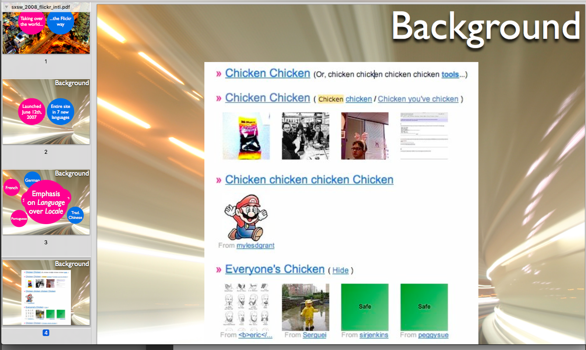

# go-chicken

🐔 🐔 🐔

## Install

```
make build
```

This will build a copy of `chicken` and put it in the [bin](bin) directory.

## Usage

```
$> ./bin/chicken -h
Usage of ./bin/chicken:
  -clucking
	Make chicken noises
  -language string
	A valid ISO-639-3 language code. (default "zxx")
```

### Chicken

```
$> ./bin/chicken ./cmd/chicken.go
🐔 🐔

🐔 (
	"🐔"
	"🐔"
	"🐔"
	"🐔.🐔/🐔/🐔-🐔"
	"🐔"
)

🐔 🐔() {

	🐔 🐔 🐔 🐔 🐔.🐔("🐔", "🐔", "🐔 🐔 🐔-639-3 🐔 🐔.")
	🐔 🐔 🐔 🐔 🐔.🐔("🐔", 🐔, "🐔 🐔 🐔")

	🐔.🐔()

	🐔, 🐔 :🐔 🐔 🐔.🐔(*🐔, *🐔)

	🐔 🐔 !🐔 🐔 🐔 {
		🐔(🐔)
	}

	🐔 _, 🐔 :🐔 🐔 🐔 🐔.🐔() {

		🐔 🐔 *🐔.🐔

		🐔 🐔 🐔 🐔🐔 🐔 "-" {
			🐔 🐔 🐔 🐔.🐔(🐔.🐔)
		} 🐔 {

			🐔, 🐔 :🐔 🐔 🐔.🐔(🐔)

			🐔 🐔 !🐔 🐔 🐔 {
				🐔(🐔)
			}

			🐔 🐔 🐔 🐔.🐔(🐔)
		}

		🐔 🐔.🐔() {
			🐔 :🐔 🐔 🐔.🐔()
			🐔.🐔(🐔.🐔(🐔))
		}
	}
}
```

### Languages

```
$> ./bin/chicken -language eng ./cmd/chicken.go
chicken chicken

chicken (
	"chicken"
	"chicken"
	"chicken"
	"chicken.chicken/chicken/chicken-chicken"
	"chicken"
)

chicken chicken() {

	chicken chicken chicken chicken chicken.chicken("chicken", "chicken", "chicken chicken chicken-639-3 chicken chicken.")
	chicken chicken chicken chicken chicken.chicken("chicken", chicken, "chicken chicken chicken")

	chicken.chicken()

	chicken, chicken :chicken chicken chicken.chicken(*chicken, *chicken)

	chicken chicken !chicken chicken chicken {
		chicken(chicken)
	}

	chicken _, chicken :chicken chicken chicken chicken.chicken() {

		chicken chicken *chicken.chicken

		chicken chicken chicken chickenchicken chicken "-" {
			chicken chicken chicken chicken.chicken(chicken.chicken)
		} chicken {

			chicken, chicken :chicken chicken chicken.chicken(chicken)

			chicken chicken !chicken chicken chicken {
				chicken(chicken)
			}

			chicken chicken chicken chicken.chicken(chicken)
		}

		chicken chicken.chicken() {
			chicken :chicken chicken chicken.chicken()
			chicken.chicken(chicken.chicken(chicken))
		}
	}
}
```

### Reading from STDIN

You can tell `chicken` to read from STDIN by passing `-` as its input argument.

```
$> yes | ./bin/chicken -language hbo -
עוף
עוף
עוף
עוף
עוף
עוף
עוף
```

Or:

```
$> echo "hello there :chicken:" | ./bin/chicken -
🐔 🐔 🐔
```

## Clucking

_Language support for clucking is not uniformly supported yet._

```
$> ./bin/chicken -language eng -clucking ./cmd/chicken.go

bok bok b'gawk cluck cluck

bok bok b'gawk (
	"bok bok b'gawk"
	"bok bok bok"
	"cluck cluck"
	"bok bok bok.bok bok b'gawk/bok bok bok/cluck cluck-bok bok b'gawk"
	"bok bok bok"
)

cluck cluck bok bok b'gawk() {

	bok bok bok bok bok b'gawk cluck cluck bok bok b'gawk bok bok b'gawk.bok bok b'gawk("bok bok b'gawk", "cluck cluck", "bok bok b'gawk bok bok bok cluck cluck-639-3 bok bok bok bok bok bok.")
	bok bok bok cluck cluck cluck cluck bok bok bok cluck cluck.bok bok b'gawk("bok bok b'gawk", cluck cluck, "bok bok b'gawk cluck cluck bok bok bok")

	cluck cluck.cluck cluck()

	bok bok bok, bok bok bok :bok bok bok cluck cluck bok bok bok.cluck cluck(*bok bok bok, *bok bok bok)

	bok bok bok cluck cluck !cluck cluck bok bok bok cluck cluck {
		cluck cluck(bok bok bok)
	}

	bok bok bok _, bok bok b'gawk :cluck cluck bok bok bok bok bok b'gawk bok bok b'gawk.cluck cluck() {

		cluck cluck cluck cluck *bok bok bok.bok bok b'gawk

		bok bok b'gawk bok bok b'gawk bok bok b'gawk bok bok b'gawkbok bok bok cluck cluck "-" {
			bok bok b'gawk bok bok b'gawk cluck cluck cluck cluck.bok bok bok(bok bok bok.bok bok bok)
		} bok bok b'gawk {

			cluck cluck, cluck cluck :bok bok bok bok bok bok bok bok b'gawk.bok bok bok(bok bok b'gawk)

			bok bok b'gawk bok bok b'gawk !bok bok bok bok bok b'gawk bok bok bok {
				cluck cluck(bok bok bok)
			}

			cluck cluck bok bok bok cluck cluck cluck cluck.bok bok bok(bok bok b'gawk)
		}

		cluck cluck bok bok bok.cluck cluck() {
			bok bok b'gawk :bok bok b'gawk bok bok b'gawk bok bok bok.bok bok bok()
			cluck cluck.bok bok bok(cluck cluck.bok bok bok(bok bok bok))
		}
	}
}
```

### Rooster

`rooster` is an HTTP daemon for `chicken`. For example:

```
$> bin/rooster
2017/04/30 09:53:53 🐓 on localhost:1280
```

And then:

```
$> curl -X POST 'http://localhost:1280' -d 'Hello world'
🐔 🐔

$> curl -X POST 'http://localhost:1280?language=eng' -d 'Hello world'
chicken chicken

$> curl -X POST 'http://localhost:1280?language=kor&clucking' -d 'Hello world'
꼬꼬댁 꼬꼬댁
```

### Emoji

`chicken` uses the [go-ucd](https://github.com/cooperhewitt/go-ucd) library to convert Emoji (and other symbolic characters) in to named strings. For example:

```
$> ./bin/ucd 😸
GRINNING CAT FACE WITH SMILING EYES
```

Which becomes:

```
$> ./bin/chicken -
😸
🐔 🐔 🐔 🐔 🐔 🐔
```

### Alpha codes

Yes.

```
./bin/chicken -
hello :smiley_cat:
# BEFORE hello :smiley_cat:
# AFTER hello 😺
# BEFORE %!s(int32=128570)
# AFTER SMILING CAT FACE WITH OPEN MOUTH
🐔 🐔 🐔 🐔 🐔 🐔 🐔
```

### Unicode 10.0 Emoji

Yes.

```
./bin/chicken -
🤙
2016/06/23 07:44:32 CHAR '129305' is emoji
2016/06/23 07:44:32 BEFORE UCD '129305'
2016/06/23 07:44:32 AFTER UCD 'CALL ME HAND'
2016/06/23 07:44:32 CHAR '67' is a letter
2016/06/23 07:44:32 CHAR '65' is a letter
2016/06/23 07:44:32 CHAR '76' is a letter
2016/06/23 07:44:32 CHAR '76' is a letter
2016/06/23 07:44:32 CHAR '32' is a space
2016/06/23 07:44:32 CHAR '77' is a letter
2016/06/23 07:44:32 CHAR '69' is a letter
2016/06/23 07:44:32 CHAR '32' is a space
2016/06/23 07:44:32 CHAR '72' is a letter
2016/06/23 07:44:32 CHAR '65' is a letter
2016/06/23 07:44:32 CHAR '78' is a letter
2016/06/23 07:44:32 CHAR '68' is a letter
🐔 🐔 🐔
```

_Note that verbose debugging information was enabled for this example._

## But wait... there's more!

I'm not suggesting you _should_ do these things... only that you _can_ do these things...

### Compiling 🐔 

```
$> go build -o 🐔 cmd/chicken.go
$> ./🐔 -h
Usage of ./🐔:
  -clucking
   Make chicken noises
  -language string
   A valid ISO-639-3 language code. (default "zxx")
```

### If you're on a Mac

```
$> yes | ./bin/chicken -language eng -clucking - | while read line ; do say $line; done
```

_Note: this assumes you're using `bash`._

## Translations

* The current [list of translations](strings/strings.go) is very short and [your help is welcome](https://github.com/thisisaaronland/go-chicken/pulls)! The goal is to have a 🐔 for every language listed in [ISO 639-3](https://en.wikipedia.org/wiki/List_of_ISO_639-3_codes).

## Docker

[Yes](Dockerfile), for `rooster`.

```
docker build -t rooster .
docker run -it -p 1280:1280 rooster

$> curl -X POST 'http://localhost:1280' -d 'Hello world'
🐔 🐔
```

## Background



[It's all Simon's fault.](https://web.archive.org/web/20110424094905/http://hitherto.net/talk_files/sxsw_2008_flickr_intl.pdf)

## See also

* http://www.fileformat.info/info/unicode/char/1f414/index.htm
* https://en.wikipedia.org/wiki/ISO_639-2#Special_situations
* https://github.com/cooperhewitt/go-ucd
* https://web.archive.org/web/20110424094905/http://hitherto.net/talk_files/sxsw_2008_flickr_intl.pdf
